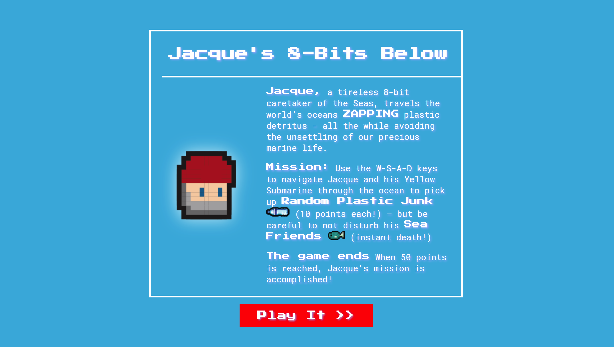
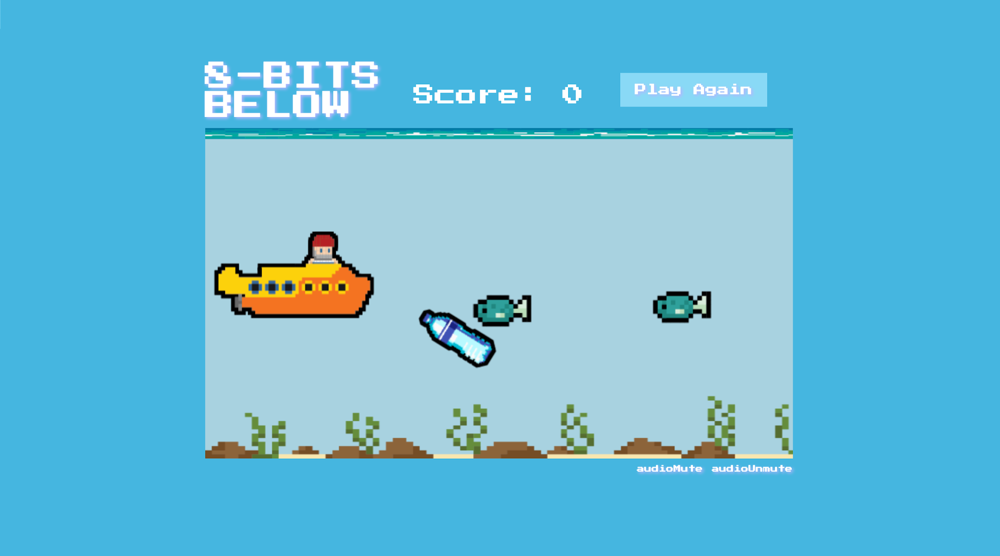

# 8-BITS BELOW - Project 1 - SEI503 #

## Elevator Pitch ##
In this classic "side-scroller" game, Jacque, a tireless 8-bit caretaker of the Seas, travels the world’s oceans ZAPPING plastic detritus - all the while avoiding the unsettling of our precious marine life. The player piece looks like Jacque Costeau’s toqued head poking out of a Beatles-style yellow submarine. In a nod to his beloved marine laboratory vessel, The Calypso, Carribean music plays in the background. Sound effects occur when he collides with a Sea Friend (instant death!), or Random Plastic Junk (10 points!), accordingly. When 100 points are reached (the ocean is now spotless!), the game ends. 

## MVP ##
- Introduction screen: An overlay menu with Jacque's backstory, mission and basic game instructions. Also has "decent" logo marquee. 
- "Start Game" button. 
- Scrolling background
- Points counter
- "Nintendo" style Calypso music
- Player controlled submarine using w-a-s-d keys
- Waves of seaFriends (one fish graphic)
- Waves of SeaTrash (one SeaTrash graphic)
- Hit detection that ends game if the player collides with Sea Friends
- Hit detection increases points when player collides with Sea Trash
- Music during gameplay

## Stretch Goals ##
- Map the submarine object to it's exact pixels, it triggers collision events when they don't appear close
- Volume and mute controls for the music/sound fx
- Game reset button  
- Instead of one type of sea SeaTrash - Evian bottles, Starbucks straws, and Ralph’s shopping bags could be included. Also include occasional sea floor debris.
- Instead of one type of sea SeaFriend - various marine life, fish, shark, octopus – have varying points value could be included.

## Screenshots ##

## Tech Stack ##
HTML, CSS, JavaScript, HTML Canvas, Howler

